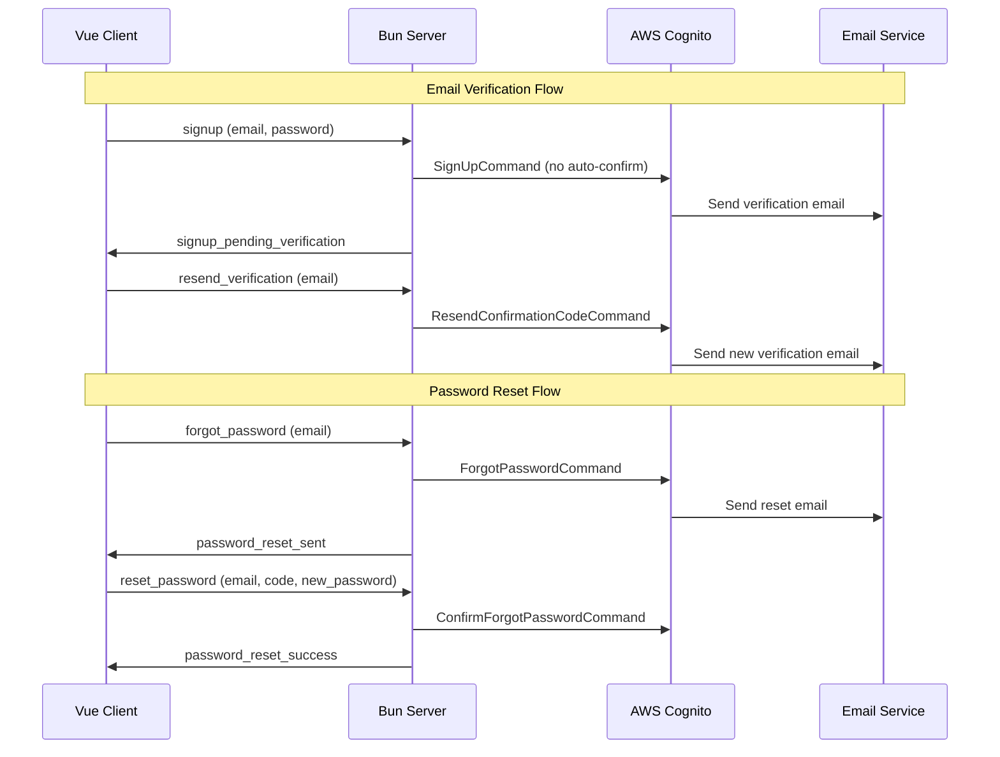

# Design Document

## Overview

This design implements email verification and password reset functionality for the Spirit of Kiro authentication system. The solution leverages AWS Cognito's built-in email verification and password recovery features while maintaining the existing WebSocket-based client-server architecture. The design focuses on seamless integration with the current Vue.js frontend and Bun WebSocket server backend.

## Architecture

### High-Level Flow



### Component Integration

The design integrates with existing components:
- **SignUpView.vue**: Modified to handle pending verification state
- **SignInView.vue**: Enhanced with forgot password and resend verification options
- **Server handlers**: New handlers for email verification and password reset flows
- **AWS Cognito**: Configured to require email verification before allowing sign-in

## Components and Interfaces

### Frontend Components

#### New Components

**ForgotPasswordView.vue**
- Standalone view for password reset request
- Form with email input and validation
- Success/error message display
- Navigation back to sign-in

**ResetPasswordView.vue**
- View for completing password reset with code
- Form with email, code, and new password fields
- Password strength validation
- Success redirect to sign-in

**EmailVerificationView.vue**
- View for handling email verification links
- Displays verification status
- Options to resend verification email
- Navigation to sign-in after success

#### Modified Components

**SignUpView.vue**
- Remove auto-confirmation logic
- Add pending verification state handling
- Display verification email sent message
- Provide resend verification option

**SignInView.vue**
- Add "Forgot Password?" link
- Add "Resend verification email" option for unverified users
- Handle new error states for unverified accounts

### Backend Handlers

#### New WebSocket Message Handlers

**forgot-password.ts**
```typescript
interface ForgotPasswordMessage {
  type: 'forgot_password';
  body: {
    email: string;
  };
}

interface ForgotPasswordResponse {
  type: 'password_reset_sent' | 'forgot_password_failure';
  body?: string;
}
```

**reset-password.ts**
```typescript
interface ResetPasswordMessage {
  type: 'reset_password';
  body: {
    email: string;
    confirmationCode: string;
    newPassword: string;
  };
}

interface ResetPasswordResponse {
  type: 'password_reset_success' | 'password_reset_failure';
  body?: string;
}
```

**resend-verification.ts**
```typescript
interface ResendVerificationMessage {
  type: 'resend_verification';
  body: {
    email: string;
  };
}

interface ResendVerificationResponse {
  type: 'verification_resent' | 'resend_verification_failure';
  body?: string;
}
```

**verify-email.ts**
```typescript
interface VerifyEmailMessage {
  type: 'verify_email';
  body: {
    email: string;
    confirmationCode: string;
  };
}

interface VerifyEmailResponse {
  type: 'email_verified' | 'email_verification_failure';
  body?: string;
}
```

#### Modified Handlers

**signup.ts**
- Remove AdminConfirmSignUpCommand
- Handle UserNotConfirmedException
- Return appropriate pending verification response

**signin.ts**
- Handle UserNotConfirmedException
- Return specific error for unverified users
- Provide resend verification option in response

## Data Models

### Cognito User Attributes

The existing user model remains unchanged, but email verification status becomes relevant:

```typescript
interface CognitoUser {
  sub: string;           // Unique user ID
  email: string;         // Email address (must be verified)
  email_verified: boolean; // Verification status
  preferred_username: string;
}
```

### WebSocket Message Types

Extended message type definitions:

```typescript
type AuthMessage = 
  | SigninMessage 
  | SignupMessage 
  | ForgotPasswordMessage
  | ResetPasswordMessage
  | ResendVerificationMessage
  | VerifyEmailMessage;

type AuthResponse = 
  | SigninResponse 
  | SignupResponse 
  | ForgotPasswordResponse
  | ResetPasswordResponse
  | ResendVerificationResponse
  | VerifyEmailResponse;
```

### Frontend State Management

Enhanced game store state:

```typescript
interface AuthState {
  userId: string | null;
  username: string | null;
  isEmailVerified: boolean;
  pendingVerification: boolean;
  verificationEmail: string | null;
}
```

## Error Handling

### Cognito Error Mapping

```typescript
const COGNITO_ERROR_MESSAGES = {
  'UserNotConfirmedException': 'Please verify your email address before signing in.',
  'CodeExpiredException': 'The verification code has expired. Please request a new one.',
  'InvalidParameterException': 'Invalid email address or verification code.',
  'LimitExceededException': 'Too many attempts. Please try again later.',
  'UserNotFoundException': 'If an account with this email exists, a reset link has been sent.',
  'InvalidPasswordException': 'Password does not meet requirements.',
  'CodeMismatchException': 'Invalid verification code. Please check and try again.'
};
```

### Client-Side Error States

- Network connectivity errors
- Invalid form submissions
- Expired verification codes
- Rate limiting responses
- Server-side validation failures

### Graceful Degradation

- Fallback to manual verification code entry if email links fail
- Clear error messages with actionable next steps
- Retry mechanisms for transient failures
- Offline state handling

## Testing Strategy

### Unit Tests

**Frontend Components**
- Form validation logic
- State management updates
- Error message display
- Navigation flows

**Backend Handlers**
- Cognito API integration
- Error handling and mapping
- Message validation
- Response formatting

### Integration Tests

**Email Verification Flow**
- Complete signup to verification workflow
- Resend verification functionality
- Expired code handling
- Invalid code scenarios

**Password Reset Flow**
- Forgot password request
- Reset code validation
- Password update completion
- Security token invalidation

### End-to-End Tests

**User Journeys**
- New user signup with email verification
- Existing user password reset
- Error recovery scenarios
- Cross-browser compatibility

### Security Testing

- Verification code expiration
- Token invalidation after use
- Rate limiting effectiveness
- Email enumeration prevention

## Security Considerations

### Token Security

- Verification codes expire after 24 hours
- One-time use tokens are invalidated after successful verification
- Rate limiting prevents brute force attacks
- Secure random code generation

### Email Security

- No sensitive information in email content
- Verification links use HTTPS only
- Email addresses are not exposed in error messages
- Proper SPF/DKIM configuration for email delivery

### Input Validation

- Server-side validation of all inputs
- Email format validation
- Password strength requirements
- XSS prevention in error messages

### Privacy Protection

- No user enumeration through error messages
- Consistent response times regardless of user existence
- Secure logging without sensitive data exposure
- GDPR compliance for email handling